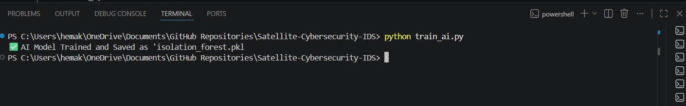
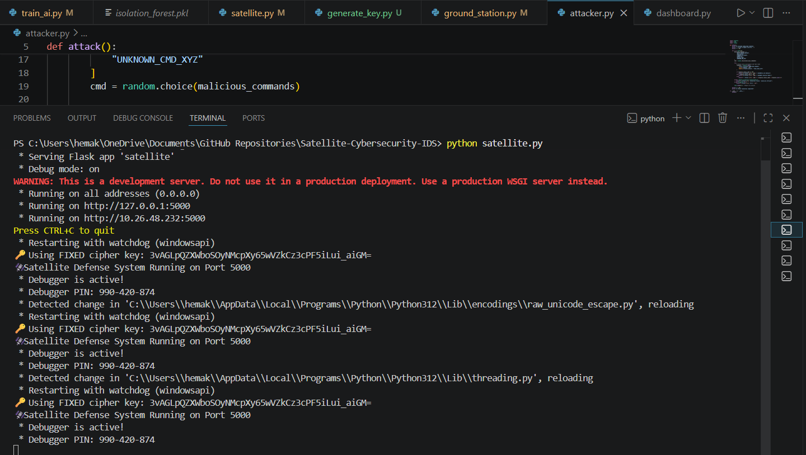
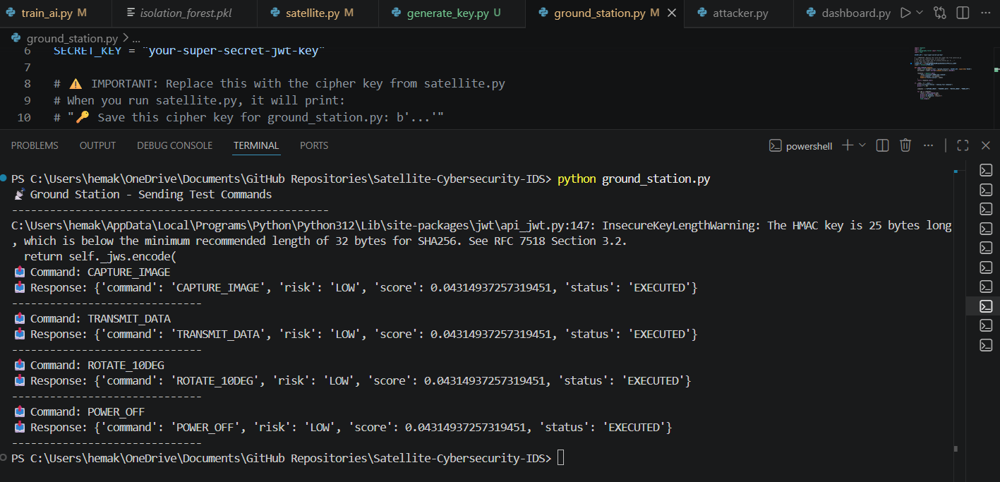
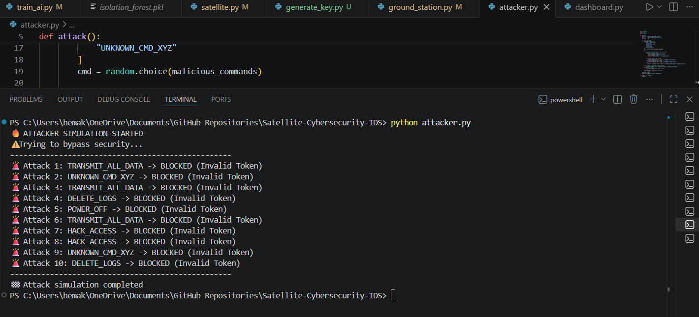
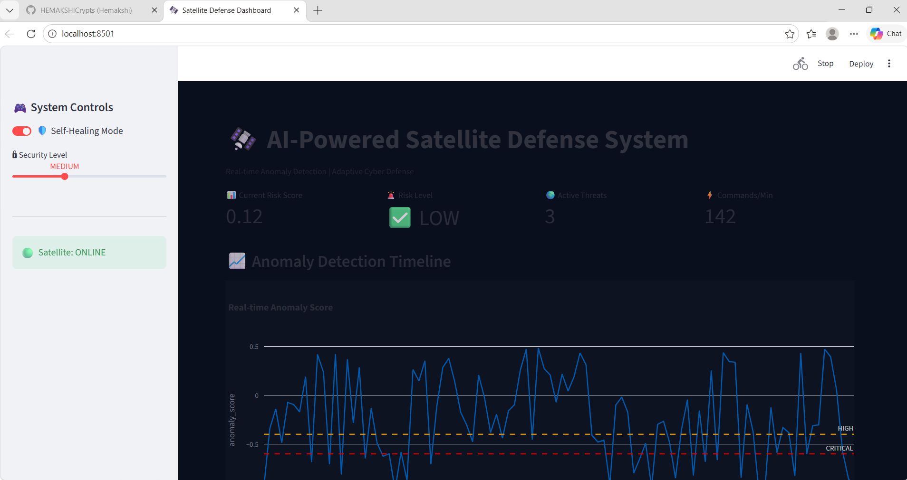

# 🛰️ AI-Powered Satellite Cybersecurity Intrusion Detection System

[](https://python.org)
[](https://scikit-learn.org)
[](https://cryptography.io)
[](https://flask.palletsprojects.com)

---

## 📌 Project Overview

This is an **AI-powered Intrusion Detection System (IDS)** for satellite communications. It simulates real-world cybersecurity used by space agencies like **ISRO, NASA, and SpaceX**.

The system learns "normal" satellite behavior using Machine Learning and automatically detects & blocks cyber attacks in real-time.

---

## 🔐 Features

| Feature | Description | Technology |
|---------|-------------|------------|
| **Command Authentication** | Every command must have valid token | JWT |
| **Command Encryption** | Military-grade encryption for all commands | Fernet (AES-128) |
| **AI Anomaly Detection** | Learns normal patterns, detects attacks | Isolation Forest |
| **Self-Healing Defense** | Automatically blocks malicious IPs | Python |
| **Real-time Dashboard** | Live attack monitoring & visualization | Streamlit + Plotly |
| **Attack Simulation** | Tests system against 10+ attack patterns | Custom |

---

## 🎯 What Attacks It Detects

| Attack Type | Description | Detection Method |
|-------------|-------------|------------------|
| ⏰ **Timing Attack** | Commands sent at 3 AM (unusual hours) | AI anomaly score |
| ⚡ **Rapid Burst Attack** | Multiple commands in quick succession | Command interval analysis |
| 🌍 **Geo-spoofing** | Commands from unknown/untrusted IPs | IP origin tracking |
| 🔄 **Sequence Attack** | Impossible command sequences | Behavioral AI |
| 🔑 **Token Forgery** | Fake JWT tokens | JWT verification |
| 📡 **Command Injection** | Unknown/malicious commands | Command whitelisting |

---

## 🏗️ System Architecture

```

┌─────────────────┐     ┌─────────────────────────────────────────────┐
│  Ground Station │────▶│            Satellite Server                  │
│  (Command Sender)│     │  ┌─────────────────────────────────────┐   │
└─────────────────┘     │  │  1. JWT Authentication               │   │
│  │  2. Fernet Decryption                │   │
│  │  3. AI Anomaly Detection             │   │
│  │  4. Risk Assessment                  │   │
│  │  5. Self-Healing (IP Blocking)       │   │
│  └─────────────────────────────────────┘   │
└─────────────────────────────────────────────┘
│
▼
┌─────────────────────────────────────────────┐
│              Dashboard (Streamlit)           │
│  - Live Command Feed                         │
│  - Anomaly Score Graph                        │
│  - Attack Alerts                             │
│  - Geo-IP Threat Map                         │
└─────────────────────────────────────────────┘

```

---

## 📸 System Screenshots

### 1. AI Model Training


### 2. Satellite Server Running


### 3. Ground Station Sending Commands


### 4. Attacker Getting Blocked


### 5. Live Security Dashboard


---

## 🛠️ Tech Stack

| Category | Technologies |
|----------|--------------|
| **Backend** | Python, Flask, Flask-CORS |
| **Machine Learning** | Scikit-learn (Isolation Forest), Pandas, NumPy |
| **Security** | PyJWT, Cryptography (Fernet) |
| **Frontend** | Streamlit, Plotly |
| **Testing** | Custom Attack Simulator |

---

## 🚀 Installation & Setup

### Prerequisites
- Python 3.8 or higher
- pip package manager

### Step 1: Clone the Repository
```bash
git clone https://github.com/HEMAKSHICrypts/Satellite-Cybersecurity-IDS.git
cd Satellite-Cybersecurity-IDS
```

Step 2: Install Dependencies

```bash
pip install -r requirements.txt
```

Step 3: Train the AI Model

```bash
python train_ai.py
```

This creates isolation_forest.pkl - the trained AI model

Step 4: Start the Satellite Server

```bash
python satellite.py
```

Keep this terminal running

Step 5: Launch the Dashboard (New Terminal)

```bash
streamlit run dashboard.py
```

Opens browser with live dashboard

Step 6: Test with Ground Station (New Terminal)

```bash
python ground_station.py
```

Sends legitimate commands to the satellite

Step 7: Test with Attacker (New Terminal)

```bash
python attacker.py
```

Simulates cyber attacks - all should be BLOCKED

---

📊 Expected Output

✅ Normal Command (Ground Station)

```json
{
  "status": "EXECUTED",
  "command": "CAPTURE_IMAGE",
  "risk": "LOW",
  "score": 0.12
}
```

🚨 Attack Blocked (Attacker)

```json
{
  "status": "INVALID_TOKEN",
  "message": "Attack blocked by AI Defense"
}
```

📈 Dashboard Metrics

· Current Risk Score: -0.55 (HIGH)
· Active Threats: 3
· Commands/Min: 142
· Blocked IPs: 7

---

📁 Project Structure

```
Satellite-Cybersecurity-IDS/
│
├── train_ai.py              # Trains Isolation Forest model
├── satellite.py             # Main satellite server (Flask)
├── ground_station.py        # Legitimate command sender
├── attacker.py              # Attack simulation script
├── dashboard.py             # Streamlit dashboard
├── requirements.txt         # Python dependencies
├── generate_key.py          # Generates encryption key
│
├── screenshots/             # Screenshots for README
│   ├── dashboard.png
│   ├── satellite.png
│   ├── attacker.png
│   ├── groundstation.png
│   └── trainai.png
│
├── isolation_forest.pkl     # Trained AI model (auto-generated)
└── README.md                # This file
```

---

🎓 What Makes This Project Unique

Aspect Why It's Special
For a Student Extremely rare in Indian CSE curriculum
Real-World Application Simulates ISRO/NASA level security
AI + Cybersecurity Combines two high-demand fields
Production-Grade Uses JWT, Fernet, Isolation Forest
Self-Healing Automatic threat response
Visual Analytics Live dashboard with graphs

---

🔄 Future Enhancements

· Add more attack patterns (DoS, Man-in-the-Middle)
· Implement blockchain for command logging
· Add email/SMS alerts for critical attacks
· Deploy to cloud (AWS/Azure)
· Add historical attack analysis
· Multi-satellite support

---

📝 License

This project is licensed under the MIT License - see the LICENSE file for details.

---

👨‍💻 Author

Hemakshi

· GitHub: @HEMAKSHICrypts

---

⭐ Show Your Support

If you found this project helpful or interesting, please give it a ⭐ on GitHub!

---

Built with 🚀 for satellite cybersecurity

```